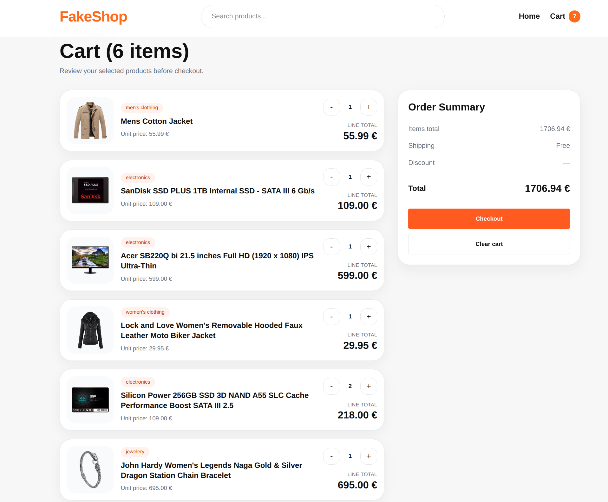

# 🛍️ FakeShop – React eCommerce App

A modern eCommerce frontend built with React using the FakeStore API.

---

## 📸 Preview

### 🏠 Home Page


### 🧩 Category Filtering


### 🛒 Cart Page



---

## 🚀 Features

* 🔄 Fetch products from FakeStore API
* 🧩 Dynamic categories (from API)
* 🎯 Category-based filtering
* 🛒 Shopping cart with quantity control
* 💾 Persistent cart using localStorage
* ⚙️ State management with useReducer
* 🔗 Shared state via React Router Outlet Context
* 💅 Clean and modern UI

---

## 🛠️ Tech Stack

* React
* React Router
* useReducer (state management)
* Tailwind CSS
* FakeStore API

---

## 📦 Installation

```bash
npm install
npm run dev
```

---

## 🌐 API

* https://fakestoreapi.com/products
* https://fakestoreapi.com/products/categories

---

## 💡 Notes

This project follows the core requirements and explores some additional improvements such as:

- category filtering  
- improved UI/UX  
- better layout consistency  
- structured state management with useReducer  

---

## 🎯 Learning Highlights

* Managing global state with useReducer
* Sharing state across routes using Outlet Context
* Working with external APIs
* Building reusable UI components
* Handling real-world UI problems (layout alignment, dynamic data)

---

## 👨‍💻 Author

Behzad Daneshgar

---
